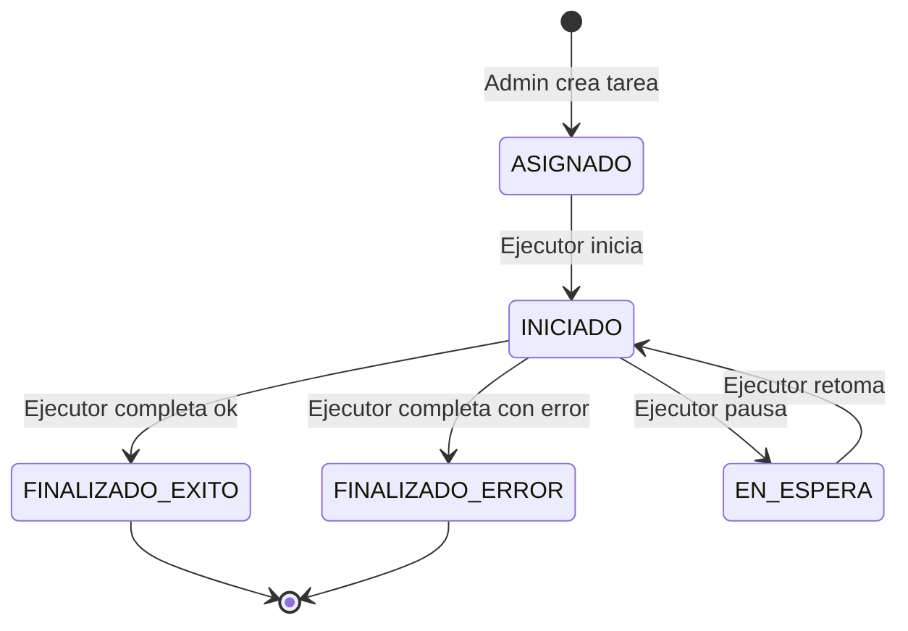
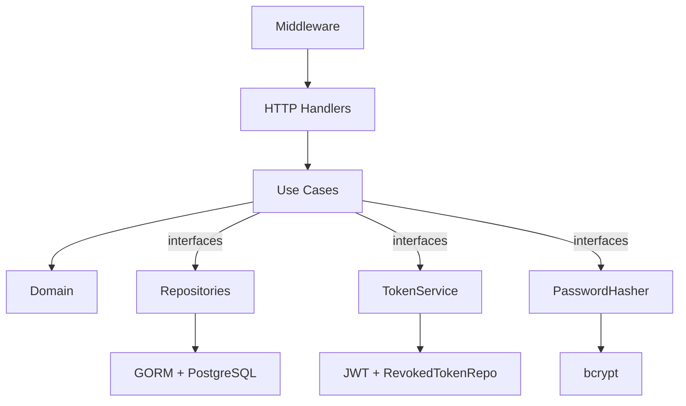

# Task API

API REST en Go para gestión de tareas con autenticación JWT y control de acceso basado en roles (Admin, Ejecutor, Auditor).

## Stack

| Componente | Tecnología |
|---|---|
| Lenguaje | Go 1.23 |
| Router | Gin |
| ORM | GORM |
| Base de datos | PostgreSQL 16 |
| Auth | JWT (golang-jwt/jwt/v5) |
| Passwords | bcrypt |
| IDs | google/uuid |
| Tests DB | SQLite en memoria |
| Infraestructura | Docker Compose |

## Cómo ejecutar

```bash
docker compose up --build
```

La API estará disponible en `http://localhost:8080`.

> **Nota de desarrollo:** La lógica de negocio está validada con tests unitarios usando mocks in-memory y SQLite. El entorno objetivo de ejecución es PostgreSQL + Docker.

## Variables de entorno

| Variable | Descripción | Requerida | Default |
|---|---|---|---|
| `DATABASE_URL` | DSN de conexión a PostgreSQL | Si | - |
| `JWT_SECRET` | Clave secreta para firmar tokens JWT | Si | - |
| `PORT` | Puerto del servidor HTTP | No | 8080 |

## Estructura

```
task-api/
├── cmd/
│   └── api/                  # HTTP server bootstrap and wiring
├── internal/
│   ├── domain/               # Core entities, policies, value objects
│   ├── handler/
│   │   └── http/             # Gin HTTP handlers and router setup
│   ├── infrastructure/
│   │   ├── crypto/           # Bcrypt password hashing
│   │   ├── jwt/              # JWT token generation & validation
│   │   └── persistence/      # PostgreSQL repos via GORM
│   ├── middleware/           # Cross-cutting HTTP middleware
│   └── usecase/              # App services orchestrating domain
```

## Usuario inicial

Al iniciar, la API crea un usuario administrador seed:

- **Email:** `admin@admin.com`
- **Password:** `Admin1234!`
- **must_change_password:** `true`

> **Seguridad:** Este usuario existe solo para bootstrap. Debe cambiar su contraseña en el primer login antes de poder operar.

## Endpoints

### Autenticación (público)

| Método | Ruta | Descripción |
|---|---|---|
| POST | `/auth/login` | Login, devuelve access + refresh token |

### Autenticación (requiere token)

| Método | Ruta | Descripción |
|---|---|---|
| POST | `/auth/logout` | Cierra sesión (revoca refresh token) |
| PUT | `/auth/password` | Cambiar contraseña (no requiere password cambiado) |

### Admin (requiere rol admin + password cambiado)

| Método | Ruta | Descripción |
|---|---|---|
| POST | `/admin/users` | Crear usuario (executor/auditor) |
| GET | `/admin/users` | Listar usuarios |
| GET | `/admin/users/:id` | Ver usuario |
| PUT | `/admin/users/:id` | Actualizar usuario |
| DELETE | `/admin/users/:id` | Eliminar usuario |
| POST | `/admin/tasks` | Crear tarea (asignar a executor) |
| GET | `/admin/tasks` | Listar todas las tareas |
| GET | `/admin/tasks/:id` | Ver detalle de tarea |
| PUT | `/admin/tasks/:id` | Actualizar tarea (solo si ASIGNADO) |
| DELETE | `/admin/tasks/:id` | Eliminar tarea (solo si ASIGNADO) |

### Ejecutor (requiere rol executor + password cambiado)

| Método | Ruta | Descripción |
|---|---|---|
| GET | `/tasks` | Listar mis tareas |
| GET | `/tasks/:id` | Ver detalle de mi tarea |
| PUT | `/tasks/:id/status` | Actualizar estado |
| POST | `/tasks/:id/comments` | Agregar comentario (solo si vencida) |

### Auditor (requiere rol auditor + password cambiado)

| Método | Ruta | Descripción |
|---|---|---|
| GET | `/audit/tasks` | Listar todas las tareas |
| GET | `/audit/tasks/:id` | Ver detalle de tarea |

## Ejemplos de uso

### Login

```bash
curl -X POST http://localhost:8080/auth/login \
  -H "Content-Type: application/json" \
  -d '{"email": "admin@admin.com", "password": "Admin1234!"}'
```

Respuesta:
```json
{
  "access_token": "eyJ...",
  "refresh_token": "eyJ...",
  "must_change_password": true
}
```

> Si `must_change_password` es `true`, el usuario solo puede acceder a `PUT /auth/password` hasta cambiar su contraseña.

### Cambio de contraseña

```bash
curl -X PUT http://localhost:8080/auth/password \
  -H "Authorization: Bearer <access_token>" \
  -H "Content-Type: application/json" \
  -d '{"current_password": "Admin1234!", "new_password": "NuevaPass123!"}'
```

### Crear tarea (admin)

```bash
curl -X POST http://localhost:8080/admin/tasks \
  -H "Authorization: Bearer <access_token>" \
  -H "Content-Type: application/json" \
  -d '{"title": "Revisar logs", "description": "...", "assigned_to": "<user_id>", "due_date": "2025-12-31T23:59:59Z"}'
```

### Actualizar estado de tarea (ejecutor)

```bash
curl -X PUT http://localhost:8080/tasks/<task_id>/status \
  -H "Authorization: Bearer <access_token>" \
  -H "Content-Type: application/json" \
  -d '{"status": "INICIADO"}'
```

## Flujo de estados



## Arquitectura



## Decisiones de diseno

### Arquitectura en capas liviana

No se usa clean architecture dogmatica ni hexagonal estricta. La separacion es: dominio puro, use cases como orquestadores, handlers delgados, infraestructura concreta. Suficiente para testear sin infraestructura real, sin las capas extras que una API CRUD no necesita.

### Dominio sin dependencias externas

Las entidades, politicas y la maquina de estados no importan ningun paquete externo. Esto permite testearlas de forma aislada y rapida, sin mocks ni setup.

### Maquina de estados explicita

Las transiciones validas se definen como un mapa de datos (`validTransitions`), no como cadenas de ifs. Agregar un estado nuevo es agregar una entrada al mapa.

### Vencimiento separado del estado del workflow

`IsExpired` es una funcion temporal, no un estado. Una tarea puede estar EN_ESPERA y vencida al mismo tiempo. El vencimiento bloquea acciones (actualizar estado), no cambia el estado en si.

### Politicas como funciones puras

`CanExecutorUpdateTask`, `CanAddComment`, `CanViewTask` son funciones sin efectos secundarios en el paquete domain. Los use cases las invocan; los handlers nunca las ven directamente.

### MustChangePassword como claim JWT + middleware

El flag viaja en el token. Un middleware (`RequirePasswordChanged`) bloquea todos los endpoints protegidos excepto `PUT /auth/password`. No se necesita consultar la DB en cada request para verificar este estado.

> **Nota:** Despues de cambiar la contrasena exitosamente, el access token activo sigue teniendo `must_change_password: true` en sus claims hasta que expire. El usuario debe re-autenticarse (`POST /auth/login`) para obtener un token con el claim actualizado. Decision deliberada: agregar una blacklist de access tokens eliminaria el beneficio de JWT stateless.

### Access + Refresh con claim typ

Cada token lleva un campo `typ` ("access" o "refresh") que impide usar un refresh token como access y viceversa. Mitiga ataques de intercambio de tokens.

### Logout revoca refresh por jti

El access token expira naturalmente (TTL 15min). Solo el refresh token se revoca en DB por su `jti`. Ventana maxima de 15 minutos donde un access token robado sigue siendo valido — para esta prueba, la simplicidad justifica el trade-off.

### Modelos GORM separados con mappers explicitos

Los modelos de persistencia (`models/`) son structs separados del dominio. Mappers `UserToModel`/`UserToDomain` hacen la conversion explicita. Esto evita que tags de GORM contaminen el dominio.

### Role y TaskStatus como string en DB

Se almacenan como `varchar` en PostgreSQL. En Go son tipos fuertes (`type Role string`). La conversion es implicita via cast. No se necesita un enum de DB para esta escala.

## Testing

```bash
# Todos los tests
go test ./...

# Con verbose
go test -v ./...

# Solo dominio
go test ./internal/domain/...

# Solo use cases
go test ./internal/usecase/...
```

| Capa | Que se testea | Estrategia |
|---|---|---|
| Domain | Transiciones de estado, expiracion, politicas | Tests unitarios puros, sin dependencias |
| Use Cases | Orquestacion, validaciones de negocio | Mocks in-memory (repos, clock) |
| Middleware | RequirePasswordChanged, RequireRole | httptest + gin en modo test |
| Persistence | CRUD de repos, mapeo de errores | SQLite en memoria, sin Docker |

## Limitaciones y mejoras futuras

Funcionalidad dejada fuera por priorizacion de calidad sobre completitud:

- **Endpoint `/auth/refresh`**: No implementado. El access token tiene TTL de 15 minutos y no hay forma de renovarlo sin re-login. Es el siguiente paso natural; la infraestructura de refresh tokens ya existe (generacion, parsing, revocacion), falta el endpoint y el use case.
- **Validacion de fortaleza de password**: Solo se valida que no sea vacio (binding de Gin). En produccion se agregarian reglas de largo minimo, complejidad y verificacion contra diccionarios.
- **Seed admin con credenciales fijas**: `admin@admin.com` / `Admin1234!` existe solo para bootstrap. En un entorno real vendrian por secret management o por un proceso de setup inicial.

Mejoras tecnicas para una segunda iteracion:

- **Migraciones versionadas** en lugar de AutoMigrate de GORM (golang-migrate o similar).
- **Paginacion** en endpoints de listado (actualmente devuelven todos los registros).
- **Graceful shutdown** con captura de senales OS y context cancellation en el servidor HTTP.
- **Refresh token rotation**: al usar un refresh token, invalidar el anterior y emitir uno nuevo para limitar la ventana de uso de tokens robados.